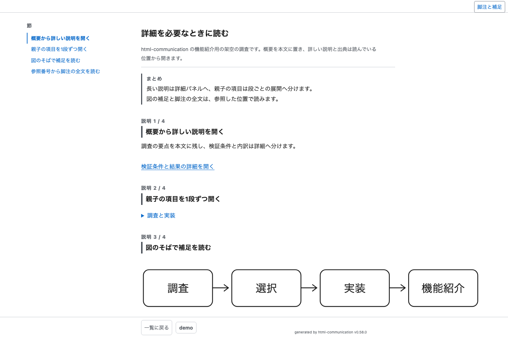
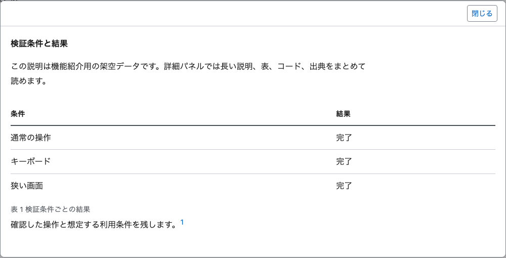
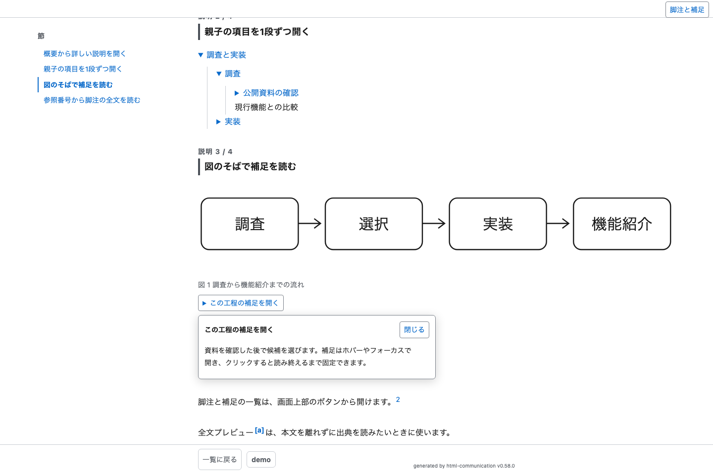
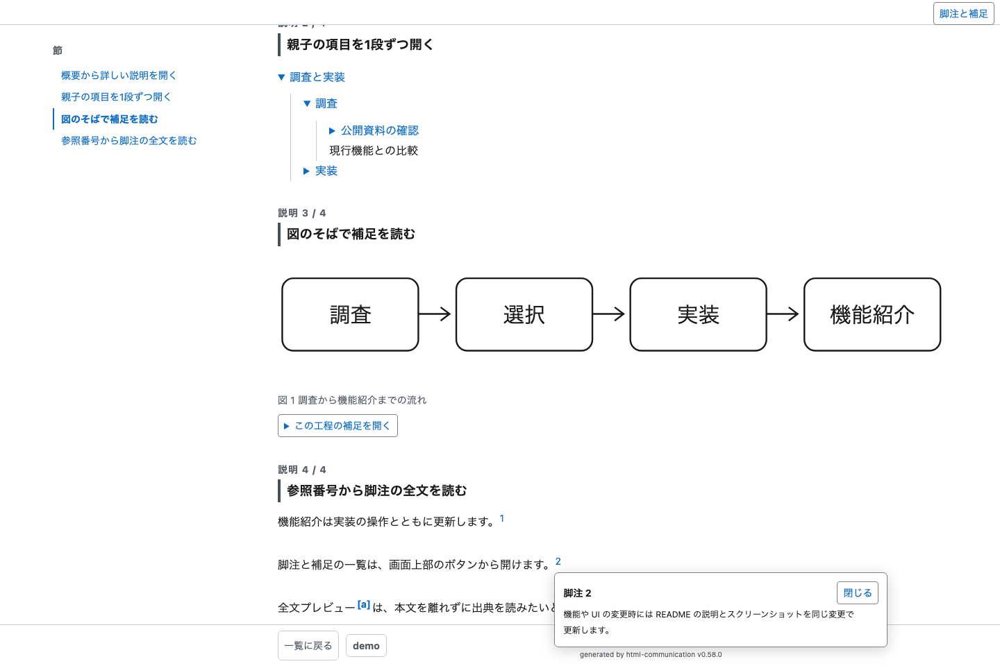
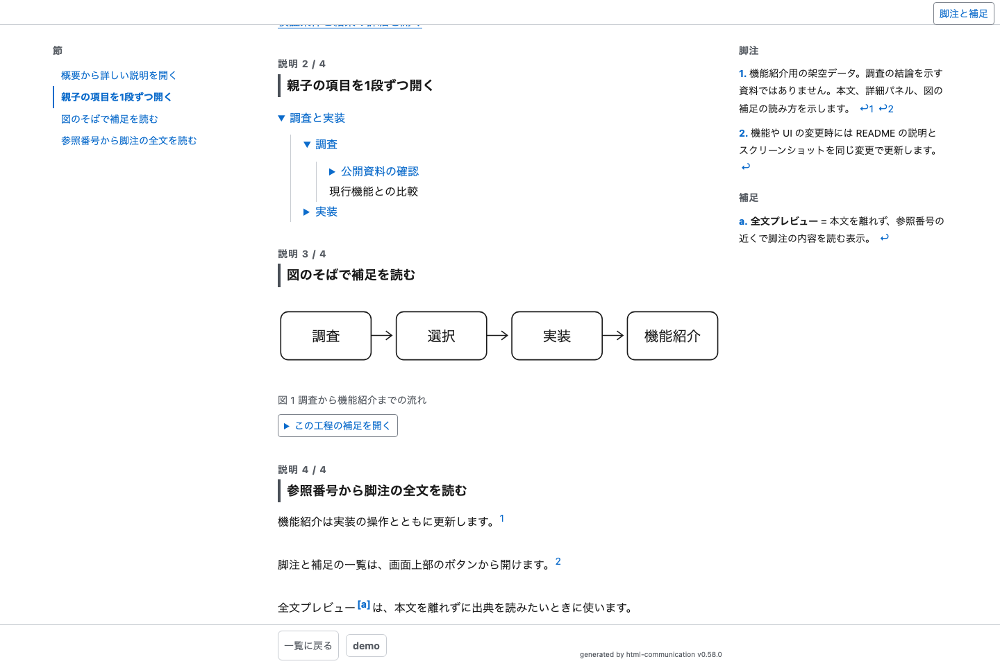
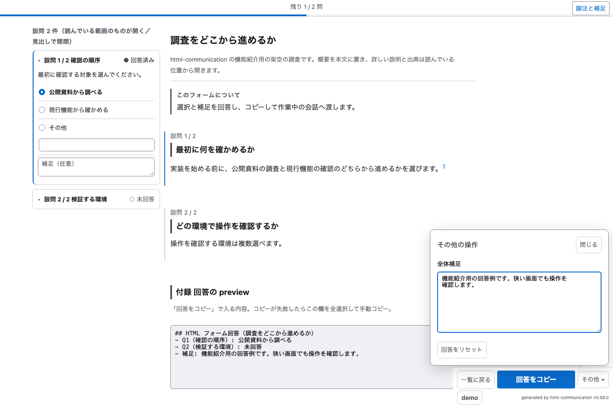

# claude-user-communication

対応 CodingAgent: Claude Code + Codex。

調査報告・比較・確認を HTML ページで提示し、回答を記録する plugin。
`html-communication` skill と、提示前レビューの判定資料を両方で共有する。
Claude Code では同梱の名前付き agent、Codex では子 agent が判定資料を使う。

- html-communication: 入り組んだ説明・報告・確認を self-contained な HTML ページ（claude-html-communication）で提示する運用一式。
  本文は生成元 JSON（配信ディレクトリの `src/`）に書き、閲覧用 HTML は `assemble-page.mjs` だけが生成する
  （読み取り専用。書式は `references/page-format.md`）。回答は `record-answer.mjs` が JSON に記録し、
  ページ・index・archive を揃える。index 管理・閲覧先の提示・下書きプロトコル・PWA アセットの再生成
  （`templates/` に雛形を同梱）・HTML フォームの設問の作りと回答の受け取り
  上部に残回答量を表示し、回答コピーを常時表示する。全体補足とリセットは操作メニューから使う
- 文のレビュー: form と report の両方で、意味の取れない文と未定義の呼び名を挙げる。生成元 JSON（と図の markup・D2 の原文）だけを読む
- 内容のレビュー: form で一次情報、推奨・選択肢、設問の構成を確認する

## 機能

### レポートと確認フォーム

レポートは要点と詳細を順に読み、確認フォームは判断材料のそばで回答する。
本文、設問または目次、脚注の各欄は画面幅に合わせて並ぶ。
ライト・ダーク表示、印刷、画像の拡大、ページと回答の記録に対応する。



### 詳細パネル

「詳細を開く」リンクから、本文に重なる広いパネルを開く。
長い説明、表、コード、出典をパネルへ分け、概要を短く保つ。
閉じるボタンまたは Escape キーで戻り、キーボードフォーカスは開いたリンクへ戻る。



### 親子の項目の展開

親の項目を開くと子の項目が現れる。
さらに詳しく読む項目だけを、本文で 1 段ずつ展開できる。


### 図の補足

図の補足をマウスのホバーやキーボードフォーカスで開く。
ホバー中は「クリックで固定」と表示し、クリックすると離れても閉じない。
タッチでは 1 回のタップで開いて固定する。
補足へポインターを移して読めるほか、閉じるボタン、外側の操作、Escape キーで閉じられる。



### 脚注と補足の全文

参照番号のそばで脚注や用語の補足を全文表示する。
脚注欄は普段は閉じ、画面上部の右端から一覧を開閉できる。
スクリプトが動かない場合と印刷時にも、本文と脚注の全文を残す。





### 回答の操作

上部のバーと中央の残問数が、未回答の量を示す。
ラジオ、複数選択、項目別の選択と補足を下書きへ自動保存し、回答をまとめてコピーする。
コピー成功はボタンへ 3 秒間表示する。
全体への補足とリセットは「その他」にまとめ、コピー操作を広く表示する。
受領済みの回答は入力できない状態で読み返せる。



### 表現の見本を選ぶ

ギャラリーは、資料の内容に合う表現を任意に選ぶための見本集。
採用条件と近縁表現との違いは[見せ方のパターン集](./skills/html-communication/references/patterns/README.md)にある。
詳細表示や脚注プレビューの固定操作は共通実装が提供する。

## Requirements

- Node.js と `npx`: ページの生成・検査・回答記録に使う
- `jq`: 検査結果の集約に使う
- `npm` と npm registry への接続: D2 の図を描画するときだけ使う。`render-d2.mjs` が実行のたびに
  `@terrastruct/d2@0.1.33` を一時ディレクトリへ入れ、終わったら消す。setup は要らない。
  取得できないときは描画だけが止まり、組み立て・検査・回答記録は D2 に依存しない。
  Codex の sandbox（workspace-write）はネットワークに出られないので、`render-d2.mjs` は sandbox の外で実行する承認を求めて回す
- 提示前レビューを実行できる子 agent: Codex で使う場合に必要。利用できないときは、skill が未実施を伝えて続行の可否を確認する

## 必要な環境変数

html-communication skill は配置先と、配信する場合の URL を環境変数から解決する。
既存ページと共用するため、変数名と既定の保存先は Claude Code と Codex で同じにする。

| 変数 | 必須 | 内容 |
| --- | --- | --- |
| `HTML_COMMUNICATION_DIR` | 任意 | claude-html-communication の配置先。未設定なら `~/.local/share/claude-html-communication` |
| `HTML_COMMUNICATION_BASE_URL` | 任意 | 配信する場合のベース URL（例: `https://<host>.<tailnet>.ts.net`）。未設定ならローカルの HTML ファイルパスを提示する |

Claude Code では `settings.json` の `env` に値を設定する。

```json
{
  "env": {
    "HTML_COMMUNICATION_BASE_URL": "https://<host>.<tailnet>.ts.net"
  }
}
```

Codex では `~/.codex/config.toml` の `shell_environment_policy.set` に値を設定する。

```toml
[shell_environment_policy.set]
HTML_COMMUNICATION_BASE_URL = "https://<host>.<tailnet>.ts.net"
```

設定後に新しいセッションを開始する。
値のセットアップと配信側の構築は環境側の文書の管轄で、この plugin には含まれない。
配信は任意。ローカルファイルをそのままブラウザで開くか、Tailscale Serve 等で配信する。
Node.js または `npx` が使えなければ生成・検査は実行できない。

## 開発時の検証

`tests/*.test.mjs` を Node.js の `--test` で実行する。
ブラウザ試験は Playwright と Chromium が導入済みの場合に実行する。
別の場所に導入した Playwright を使うときは、`HTML_COMMUNICATION_PLAYWRIGHT_MODULE` に
その `index.mjs` の絶対パスを渡す。未導入ならブラウザ試験だけをスキップする。
`HTML_COMMUNICATION_SCREENSHOTS` に保存先の絶対パスを渡すと、操作欄の開閉画像も保存する。
これらは検証時の指定であり、ページを生成・閲覧するための依存は増えない。

## 機能紹介の更新

機能や UI を変更したときは、同じ変更で該当する説明と画像を更新する。
画像は[機能紹介用の生成元](./docs/features/demo-r001.json)と[確認フォームの生成元](./docs/features/demo-f001.json)を現行テンプレートで組み立て、ブラウザで撮影する。
検証用の明暗・狭幅の画像は、README に掲載する画像とは別に扱う。

Playwright と Chromium が使える開発環境で、次のコマンドを実行する。
`<plugin root>`はこの README があるディレクトリの絶対パスに置き換える。

```sh
node "<plugin root>/scripts/capture-features.mjs"
```

Playwright を別の場所へ導入した場合は、ブラウザ試験と同じく`HTML_COMMUNICATION_PLAYWRIGHT_MODULE`へその`index.mjs`の絶対パスを指定する。
画像は[README 用画像](./docs/images/)へ保存する。
撮影後は変更した機能の操作状態と文字の可読性を確認し、説明との食い違いを直す。
